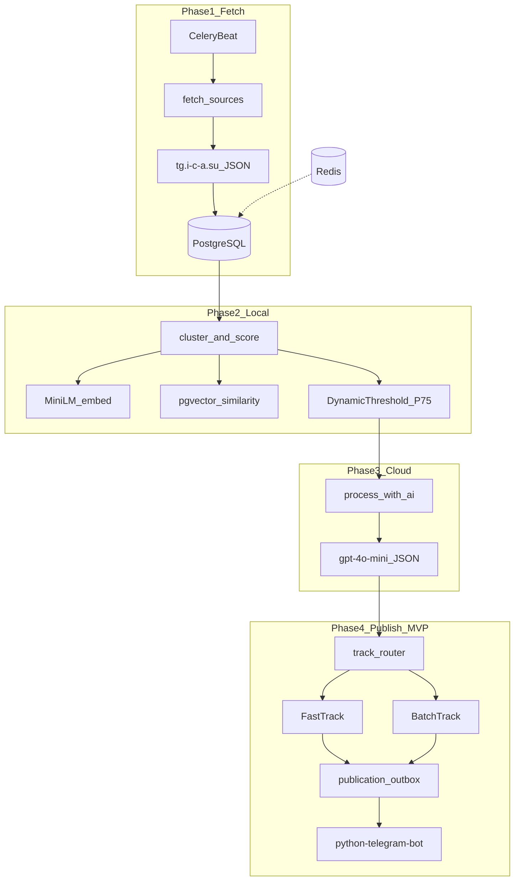
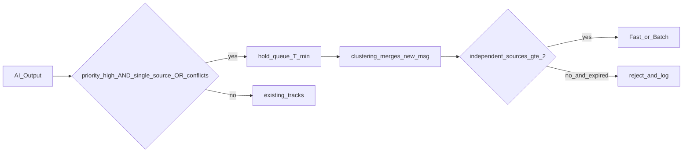
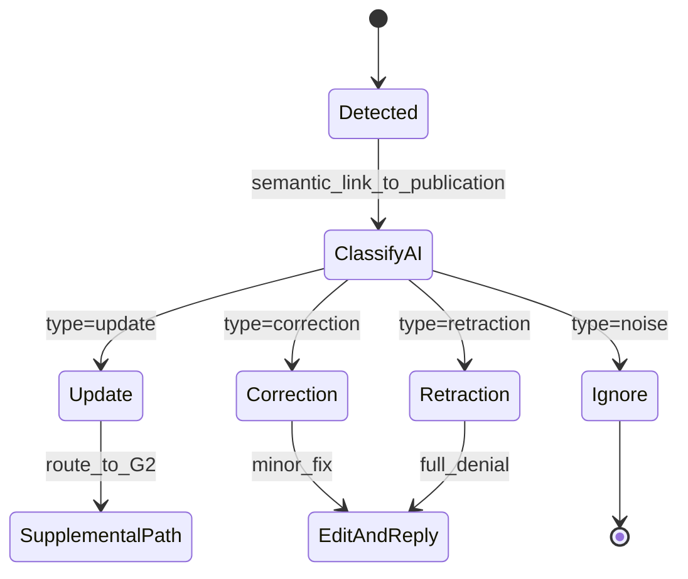
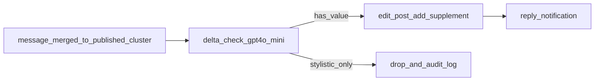

# طرح پیاده‌سازی سامانه خبرگزین

## وضعیت فعلی

ریپازیتوری [`khabargozin`](c:\Users\golaf\source\repos\khabargozin) **کاملاً خالی** است (فقط `git init`، بدون commit). تمام پیاده‌سازی از صفر انجام می‌شود.

**انتخاب‌های شما:**
- مرحله‌بندی کامل: **MVP = اسپرینت A–D** (مسیر اصلی Fast/Batch)؛ Hold/Retraction/Supplemental = **فاز ۲ (E–H)**
- مدیریت منابع: دیتابیس + seed؛ **بدون UI وب**، با **CLI debug** (inspect/reprocess/dry-run)

---

## فازبندی MVP vs فاز ۲

| فاز | اسپرینت | محتوا |
|-----|---------|-------|
| **پیش‌نیاز** | **0** | Spike ICA API — تأیید pagination و ساختار پاسخ |
| **MVP** | A | scaffold, DB+pgvector, seed, fetcher, CLI پایه |
| **MVP** | B | clustering, merge **open only**, independent_source در merge |
| **MVP** | B.5 | `ai_dry_run.py` — اعتبارسنجی prompt قبل از pipeline کامل |
| **MVP** | C | AI pipeline, json_schema + fallback, circuit breaker |
| **MVP** | D | outbox publish, Fast/Batch, HTML formatter, FloodWait |
| **فاز ۲** | E | Redis buffer, archiving, source_stale, media پیشرفته |
| **فاز ۲** | F | Hold/Verify, locked_for_hold, AI re-run |
| **فاز ۲** | G | Retraction FSM, Supplemental, merge strict published |
| **فاز ۲** | H | KPI, token accounting, test matrix کامل |

**هدف MVP:** end-to-end قابل تست (Fetch → Cluster → AI → Publish) بدون Hold/Retraction/Supplemental.

---

## معماری کلی



**سرویس‌های Docker Compose:**
- `postgres` — داده اصلی + **pgvector** extension
- `redis` — broker Celery (+ buffer فاز ۲/E)
- `worker` — Celery worker (tasks پردازش)
- `beat` — Celery Beat (intervalها از env؛ پیش‌فرض fetch هر **۵ دقیقه** = 300s)
- `flower` (اختیاری) — مانیتورینگ صف

---

## ساختار پوشه‌ها

```
khabargozin/
├── app/
│   ├── config.py              # pydantic-settings
│   ├── main.py                # entrypoint healthcheck
│   ├── db/
│   │   ├── base.py
│   │   ├── session.py
│   │   └── models/
│   │       ├── source.py
│   │       ├── message.py
│   │       ├── cluster.py
│   │       ├── publication.py
│   │       ├── publication_outbox.py
│   │       └── audit_log.py
│   ├── fetcher/
│   │   ├── base.py            # FetcherBackend Protocol
│   │   ├── factory.py         # get_fetcher() — swap ICA/Telethon
│   │   ├── ica_client.py      # ICAFetcher(FetcherBackend)
│   │   └── media_filter.py
│   ├── clustering/
│   │   ├── embedder.py        # MiniLM — تولید embedding
│   │   ├── vector_search.py   # pgvector similarity (نه cosine در Python)
│   │   ├── ner.py             # Hazm NER — فقط تقویتی (دقت ~70%)
│   │   ├── event_signature.py # امضای رویداد — تقویتی
│   │   ├── scorer.py          # cluster_score + credibility
│   │   ├── merge.py           # MVP: open only
│   │   ├── merge_published.py # فاز ۲ (G): strict + supplemental
│   │   ├── lineage.py         # independent_source_count
│   │   └── threshold.py       # percentile + fallback + clamp
│   ├── ai/
│   │   ├── client.py          # OpenAI + json_schema + retry
│   │   ├── prompts.py
│   │   ├── parser.py          # JSON + retry با پرامپت ساده
│   │   └── guardrails.py      # sensitivity rules
│   ├── publisher/
│   │   ├── bot.py
│   │   ├── telegram_retry.py  # FloodWait / 429 retry
│   │   ├── formatter.py       # HTML parse_mode + attribution
│   │   ├── outbox.py          # publication_outbox flow
│   │   ├── tracks.py          # Fast / Batch / Hold routing
│   │   ├── retraction.py      # فاز ۲ / Sprint G
│   │   ├── retraction_state.py
│   │   └── supplemental.py    # فاز ۲ / Sprint G
│   ├── tasks/
│   │   ├── celery_app.py
│   │   ├── fetch.py
│   │   ├── cluster.py
│   │   ├── ai.py
│   │   └── publish.py
│   └── resilience/
│       ├── redis_buffer.py
│       ├── idempotency.py
│       ├── locking.py           # SELECT FOR UPDATE + assert_no_slow_ops
│       └── task_lock.py         # Celery singleton advisory lock
├── migrations/                # Alembic (+ pgvector); archive در migration فاز ۲
├── docs/
│   ├── ica_api_notes.md       # خروجی Sprint 0
│   └── outbox_reconcile.md    # الگوریتم reconcile_outbox
├── scripts/
│   ├── seed_sources.py        # + credibility policy table
│   ├── ica_spike.py           # Sprint 0 — validate ICA API
│   ├── ai_dry_run.py          # Sprint B.5 — prompt روی خوشه‌های واقعی
│   ├── reconcile_outbox.py    # outbox status=unknown
│   ├── inspect_source.py
│   ├── inspect_cluster.py
│   ├── reprocess_cluster.py
│   ├── dry_run_publish.py
│   └── kpi_report.py
├── tests/
│   ├── fixtures/              # پیام/خوشه/AI mock
│   ├── scenarios/             # سناریوهای merge/hold/retraction/confidence
│   └── test_matrix.md         # جدول سناریو × انتظار
├── docker-compose.yml
├── Dockerfile
├── pyproject.toml
├── .env.example
└── README.md
```

---

## طرح دیتابیس (PostgreSQL + pgvector)

**پیش‌نیاز:** `CREATE EXTENSION vector;` — embedding در `messages.embedding` و `clusters.centroid_embedding` از نوع `vector(384)` (MiniLM).

| جدول | فیلدهای کلیدی | نقش |
|------|---------------|-----|
| `sources` | `username`, `display_name`, `is_active`, `credibility_weight` (0.5–1.5), `source_type` (official/news_agency/general/tech/religious), `political_bias_tag` (nullable), `is_primary_source`, `last_message_id`, `last_successful_fetch_at`, `fetch_error_count`, `last_error` | کانال مرجع |
| `messages` | `source_id`, `message_id`, `reply_to_message_id`, `text`, `text_hash`, `url`, `raw_payload`, `media_meta`, `embedding` vector(384), `published_at`, `edit_date`, `is_deleted`, `has_text`, `message_type`, `cluster_id` (FK) | پیام — **one-to-many**؛ بدون `cluster_messages` M2M |
| `clusters` | `cluster_score`, `status`, `status_reason`, `centroid_embedding`, `event_signature`, `distinct_sources` (گزارش), `independent_source_count` (تصمیم), `locked_for_hold`, `topic`, `sensitivity`, `window_start/end`, `last_scored_at`, `last_ai_processed_at`, `ai_independent_source_count_at_run` | خوشه |
| `ai_results` | ... + `schema_version`, `prompt_version`, token/cost fields | خروجی GPT — `editorial_priority` ۱–۵ |
| `publication_outbox` | `cluster_id`, `operation_type`, `event_key` (nullable — فاز ۲), `track`, `payload_hash`, `rendered_text_hash`, `payload_preview`, `status`, ... — **MVP:** unique `(cluster_id)` WHERE `operation_type='initial'`؛ **فاز ۲:** unique `(cluster_id, operation_type, event_key)` برای supplemental/correction/retraction چندگانه | صف انتشار |
| `app_state` | `telegram_chat_id:test`, `telegram_chat_id:production` — پس از resolve `@username` | bootstrap تلگرام |
| `publications` | `cluster_id`, `outbox_id`, `telegram_post_id`, `track`, `published_at`, `is_retracted` | نتیجه انتشار موفق |
| `hold_queue` | `cluster_id`, `expires_at`, `confirmation_count` | فاز ۲ — Hold |
| `audit_logs` | `entity_type`, `entity_id`, `action`, `reason`, `old_status`, `new_status`, `actor`, `source_snapshot`, `decision_version`, `metadata`, `created_at` | KPI + debug |

**Seed + Credibility Policy** در [`scripts/seed_sources.py`](scripts/seed_sources.py) — وزن‌ها **موضوع‌محور** (نه سلیقه‌ای):

| منبع | نوع | وزن پایه | یادداشت |
|------|-----|----------|---------|
| Tasnimnews, Farsna, Isna94, Mehrnews | `news_agency` | 1.2–1.4 | تولیدکننده خبر |
| SharghDaily, Jamarannews | `general` | 1.0–1.2 | روزنامه/تحلیلی |
| KhabarFouri, Akharinkhabar | `general` | 0.7–1.0 | فوری/بازنشر |
| Digiato | `tech` | 1.3 برای topic=tech؛ 0.9 برای سیاست | موضوع‌محور |
| aghigh_ir | `religious` | 1.0 | |

`credibility_weight` در scorer از `sources` + `topic` خوشه خوانده می‌شود — مستند در seed.

**MVP retention (بدون جدول archive):** ایندکس `messages.published_at`؛ query با cutoff. جداول `*_archive` فقط در **migration فاز ۲ (E)**.

**pgvector index:** با **`vector_cosine_ops`** (سازگار با `<=>` cosine distance). HNSW اگر نسخه مناسب؛ وگرنه IVFFlat — در README. همه similarityها با **همان metric** (cosine؛ embeddingها normalize نشده‌اند — ثابت در کد).

---

## اسپرینت ۰ — Spike ICA API ([`scripts/ica_spike.py`](scripts/ica_spike.py))

**قبل از Sprint A** — ریسک معماری‌شکن. اسکریپت ~۳۰ خطی که تأیید کند:

- [ ] pagination: `?page=2` یا offset-based؟
- [ ] ترتیب پیام‌ها: newest→oldest؟
- [ ] `published_at` timezone-aware و قابل اعتماد؟
- [ ] `edit_date` وجود دارد؟
- [ ] ساختار `media_meta`
- [ ] `limit` max واقعی
- [ ] rate-limit واقعی (۱۵/min؟)

خروجی: `docs/ica_api_notes.md` — الگوریتم fetch در A بر اساس **واقعیت** نه فرض.

---

## فاز ۱ — MVP (هسته سیستم)

### 1.1 Scaffold و زیرساخت
- `pyproject.toml`: Python 3.11+, SQLAlchemy 2, Alembic, Celery[redis], redis, httpx, openai, python-telegram-bot, sentence-transformers, pgvector, hazm (اختیاری — NER تقویتی)
- PostgreSQL با **pgvector**؛ workers از session **sync** (`postgresql+psycopg2`) برای transaction/lock ساده‌تر
- [`app/config.py`](app/config.py): `Settings` — **هیچ magic number** در business logic
- `docker-compose.yml` + `.env.example`
- Alembic migration + `CREATE EXTENSION vector` + seed
- **CLI debug** (بدون UI وب) — بخش جدا در پایین

### 1.2 Fetcher — Backend Abstraction (Sprint A)

[`app/fetcher/base.py`](app/fetcher/base.py):
```python
class FetcherBackend(Protocol):
    def fetch_messages(self, source: Source, cursor: FetchCursor) -> list[RawMessage]: ...
```

- [`ica_client.py`](app/fetcher/ica_client.py) → `ICAFetcher(FetcherBackend)`
- [`factory.py`](app/fetcher/factory.py) → `get_fetcher()` — `tasks/fetch.py` **هرگز** ICA مستقیم import نکند
- اگر Spike 0 ICA ناپایدار بود → swap با `TelethonFetcher` فقط یک کلاس جدید

**`edit_date` / ویرایش دیرهنگام:** در هر fetch cycle، علاوه بر cursor، پیام‌های اخیر با `edit_date > last_seen_edit_check` (یا re-fetch `message_id`های ۴۸h اخیر هر منبع در overlap) — برای تکذیب/اصلاح فاز ۲.

### 1.2b ICA Implementation ([`app/fetcher/ica_client.py`](app/fetcher/ica_client.py))
- Endpoint پایه: `https://tg.i-c-a.su/json/{username}?limit={FETCH_PAGE_SIZE}`
- **Dual cursor + overlap پویا:**
  - `message_id >= last_message_id - FETCH_SLIDING_WINDOW`
  - **و** `published_at >= overlap_start`

**قانون `overlap_start` — choose the older boundary (مرز قدیمی‌تر):**
```python
rolling_cutoff = now - timedelta(minutes=FETCH_TIME_OVERLAP_MINUTES)  # e.g. 60 min ago
overlap_start = min(rolling_cutoff, source.last_successful_fetch_at)   # earlier timestamp wins
```
- **حالت عادی:** `last_successful_fetch_at` تازه است → `overlap_start ≈ rolling_cutoff` (فقط N دقیقه اخیر)
- **بعد از downtime:** `last_successful_fetch_at` قدیمی‌تر است → `overlap_start = last_successful_fetch_at` (برگشت تا آخرین fetch موفق)

**مثال:** `now=12:00`, `FETCH_TIME_OVERLAP=60` → `rolling_cutoff=11:00`. اگر `last_successful_fetch_at=08:30` (قطعی ۳.۵h) → `overlap_start=08:30` (نه 11:00). اگر `last_successful_fetch_at=11:45` → `overlap_start=11:00`.

> پیاده‌سازی: `min()` روی دو `datetime` — مرز **قدیمی‌تر** را بردار تا هیچ پیامی بین دو fetch از دست نرود.
- **صفحه‌بندی (Pagination) — پوشش قطعی طولانی:**
  یک `limit=50` برای کل بازه قطعی کافی نیست. الگوریتم:
  ```
  page = 1
  loop:
    response = GET /json/{channel}?limit=FETCH_PAGE_SIZE&page={page}
    for msg in response (newest→oldest):
      if msg.published_at < overlap_start: STOP pagination (رسیدیم به مرز)
      else: queue for DB insert
    if page_empty or reached overlap_start or page >= FETCH_MAX_PAGES:
      break
    page += 1
    sleep(FETCH_PAGINATION_DELAY_SECONDS)  # رعایت ICA rate limit
  ```
  - **فرض pagination** (`?page=N`) تا Spike 0 تأیید شود — اگر offset-based بود، fetcher بازنویسی می‌شود
  - `FETCH_MAX_PAGES` سقف ایمنی برای جلوگیری از loop بی‌نهایت (پیش‌فرض ۲۰ → تا ۱۰۰۰ پیام per channel per cycle)
  - اگر پس از `FETCH_MAX_PAGES` هنوز به `overlap_start` نرسیده → `audit_log` با `fetch_backfill_incomplete` + ادامه در cycle بعدی
- `last_message_id` و `last_successful_fetch_at` فقط پس از **insert موفق** در DB به‌روز می‌شوند
- **Lookback filter:** پیام‌هایی که `published_at` آن‌ها بیش از `CLUSTER_LOOKBACK_HOURS` گذشته → **رد و لاگ** (`stale_message`)
- Rate limit: `ICA_RATE_LIMIT_PER_MIN` — فاصله بین کانال‌ها: `ICA_FETCH_DELAY_SECONDS`
- ذخیره `reply_to_message_id` برای زنجیره خبر/تکمیلی (ورودی retraction state machine)
- **Dedupe:** `ON CONFLICT (source_id, message_id) DO NOTHING` — idempotency کاملاً روی DB
- **Source stale alert:** `audit_log` + **warning در** `inspect_source` و `kpi_report` (نه فقط audit پنهان)

### 1.3 Media Filter (ساده در MVP)
- رد تصاویر با aspect ratio خارج از `MEDIA_MIN_ASPECT_RATIO` / `MEDIA_MAX_ASPECT_RATIO` (پیش‌فرض ۰.۵–۲.۰)
- رد ویدیو > `MEDIA_MAX_VIDEO_SECONDS` (پیش‌فرض ۶۰)
- انتخاب اولین مدیا معتبر

### 1.4 Clustering محلی

#### Cold Start Strategy ([`app/clustering/threshold.py`](app/clustering/threshold.py))

| مرحله | شرط | رفتار |
|-------|-----|-------|
| **۱. Warmup** | `uptime < COLD_START_WARMUP_MINUTES` (پیش‌فرض ۲۰) | فقط fetch+ذخیره؛ **بدون clustering** |
| **۲. Bootstrap** | `total_messages < COLD_START_MIN_MESSAGES` (پیش‌فرض ۵۰) | clustering با **آستانه ثابت** `CLUSTER_SCORE_FALLBACK_THRESHOLD=6.0` |
| **۳. Steady** | `uptime >= COLD_START_DYNAMIC_AFTER_HOURS` (پیش‌فرض ۲۴) | dynamic percentile فعال |

#### Embedding + Similarity Search (pgvector)

- **فاز ۱ (MVP):** فقط `paraphrase-multilingual-MiniLM-L12-v2` (CPU-friendly، ~۸۰MB RAM)
- **ParsBERT حذف** از MVP — در صورت نیاز بعداً به‌عنوان ensemble اضافه شود
- جریان: embed در Python → ذخیره `vector(384)` در DB → **جستجوی شباهت فقط در PostgreSQL:**
  ```sql
  SELECT id, 1 - (centroid_embedding <=> :query_vec) AS sim
  FROM clusters WHERE status IN (...) AND window_start > :cutoff
  ORDER BY centroid_embedding <=> :query_vec LIMIT 10;
  ```
- **ممنوع:** حلقه cosine روی همه خوشه‌ها در حافظه Python

#### NER و Event Signature — فقط تقویتی

Hazm NER دقت ~۷۰% روی اخبار فارسی دارد — **شرط سخت merge/publish روی NER نیست**. فقط boost:
- اگر `ner_overlap >= MERGE_NER_BOOST_THRESHOLD` → کاهش موقت آستانه similarity
- `event_signature_overlap` — امتیاز تقویتی، نه شرط لازم (جزئیات در merge strict)

#### Dynamic Threshold + Fallback

```
if active_cluster_count < MIN_CLUSTERS_FOR_PERCENTILE:  # پیش‌فرض 20
    effective_threshold = CLUSTER_SCORE_FALLBACK_THRESHOLD  # 6.0
else:
    effective_threshold = clamp(
        percentile(cluster_scores, CLUSTER_PERCENTILE),  # P75
        MIN_AI_SCORE_THRESHOLD,   # 5.5
        MAX_AI_SCORE_THRESHOLD    # 8.0
    )
```

#### فرمول `cluster_score` ([`app/clustering/scorer.py`](app/clustering/scorer.py))

```
weighted_sum = w_src*s + w_cred*c + w_spd*sp + w_urg*u   # topic: w_topic=0 در MVP
cluster_score = clamp(1 + 9 * (weighted_sum / (w_src + w_cred + w_spd + w_urg)), 1, 10)
```
مخرج = **جمع وزن‌های فعال** — `RAW_MAX` حذف؛ normalize خودکار.

| جزء | فرمول | env وزن |
|-----|--------|---------|
| `source_score` | `min(independent_source_count, CAP) / CAP` — از merge | `SCORER_WEIGHT_SOURCES=0.35` |
| `credibility_score` | میانگین وزنی credibility منابع مستقل | `SCORER_WEIGHT_CREDIBILITY=0.30` |
| `speed_score` | `max(0, 1 - span_minutes / SCORER_SPEED_CAP_MINUTES)` | `SCORER_WEIGHT_SPEED=0.20` |
| `urgency_score` | `min(keyword_hits, CAP) / SCORER_URGENCY_KEYWORD_CAP` | `SCORER_WEIGHT_URGENCY=0.15` |
| `topic_importance` | غیرفعال MVP (`SCORER_WEIGHT_TOPIC=0.0`) | 0.0 |

**توجه double-count (عمدی):** `source_score` = تعداد مستقل؛ `credibility_score` = کیفیت — هر دو از همان منابع. در Sprint B با داده واقعی **audit** کنید over-weighting نشود؛ تغییر طراحی فقط اگر لازم.

`distinct_sources` فقط **گزارش/KPI**.

#### `independent_source_count` — [`app/clustering/lineage.py`](app/clustering/lineage.py)

**فقط در merge** — scorer مقدار آماده می‌خواند.

```python
def recalculate_independent_sources(cluster_id) -> int:
    """
    NEVER derive from distinct_sources — that counts republishers as independent.

    1. هر منبع is_primary_source=True → +1 مستقل
    2. منابع غیر-primary: اگر text_similarity(msg_a, msg_b) > REPUBLISH_SIM_THRESHOLD (0.95)
       با پیام منبع primary دیگر → همان lineage بازنشر؛ فقط +1 برای کل lineage
    3. اگر شک → conservative (کمتر بشمار)
    """
```

**قاعده صریح:** چند پیام از منابع **مختلف** با متن copy-paste (`sim>0.95`) = **یک** lineage = **یک** `independent_source_count`. `distinct_sources` فقط برای گزارش است.

#### Merge — MVP: open only ([`app/clustering/merge.py`](app/clustering/merge.py))

**فقط خوشه‌های باز** (`pending`, `scored`, `ai_done`):
- pgvector `sim >= MERGE_OPEN_SIM` (0.72)
- **یا** (`sim >= MERGE_OPEN_SIM_NER` (0.65) **و** NER boost)

پس از attach → `lineage.recalculate_independent_sources(cluster_id)`.

**مسیر published strict → فقط فاز ۲ / Sprint G** (بخش G.0). در MVP merge به `published` **انجام نمی‌شود**.

- **Worker:** `worker_process_init` (MiniLM) + `max_tasks_per_child=100`

### 1.5 AI Processing ([`app/ai/client.py`](app/ai/client.py))

- مدل: `gpt-4o-mini`
- **Response format:** `json_schema` **preferred** → fallback `json_object` + **pydantic validation** (محدودیت SDK/مدل)
- **`OPENAI_MAX_TOKENS=800`** — فارسی توکن بیشتر مصرف می‌کند
- **Token accounting** + **circuit breaker:** اگر `sum(cost_estimate) ماه جاری > OPENAI_MONTHLY_BUDGET_USD` (پیش‌فرض ۱۵) → توقف همه AI calls (شامل re-run، delta، classify در فاز ۲)
- Retry HTTP 429: exponential backoff تا ۳ بار

### اسپرینت B.5 — AI Dry Run ([`scripts/ai_dry_run.py`](scripts/ai_dry_run.py))

**قبل از Sprint C کامل** — ۲۰–۳۰ خوشه واقعی از DB:
- ارسال prompt به GPT، چاپ JSON خام
- بررسی `confidence`, `sensitivity`, طول headline/summary
- تنظیم prompt/schema قبل از pipeline Celery

**خروجی JSON Schema:**
```json
{
  "status": "publish|reject|hold",
  "editorial_priority": 3,
  "confidence": 0.0,
  "headline": "",
  "summary": "",
  "why_it_matters": "",
  "conflicts": [],
  "sources_used": [],
  "rejection_reason": "",
  "sensitivity": "normal|political|security|casualty|market|medical",
  "needs_human_review": false
}
```

**`editorial_priority`:** integer **۱–۵** — `1-2` reject/low؛ `3-4` Batch؛ `5` Fast (با سایر شرط‌ها).

**Sensitivity guardrails** ([`app/ai/guardrails.py`](app/ai/guardrails.py)) — اگر `sensitivity` در `political|security|casualty|medical`:
- `independent_source_count >= 2`
- `confidence >= SENSITIVE_MIN_CONFIDENCE` (0.75)
- `conflicts` باید در متن نهایی صریح نمایش داده شود

**Parser** ([`app/ai/parser.py`](app/ai/parser.py)):
1. `json.loads` → **pydantic full schema validation**
2. regex extract → **دوباره pydantic validation** (خروجی نیمه‌خراب silent رد می‌شود)
3. تا `AI_JSON_MAX_RETRIES=2` با پرامپت ساده‌تر
4. پس از اتمام → reject + `audit_log` (`ai_parse_failed`)

### 1.6 Publishing (MVP: Fast + Batch) — [`app/publisher/tracks.py`](app/publisher/tracks.py)

**قانون اول — Hold lock (فاز ۲):**
```python
if cluster.locked_for_hold or exists_in_hold_queue(cluster_id):
    skip  # Hold مسئول تصمیم است؛ Batch/Fast دخالت نمی‌کنند
```

**Gating rules (MVP — بدون Hold track در routing اولیه؛ Hold در فاز ۲):**

| Track | شرط |
|-------|-----|
| **Fast** | `status=publish` **و** `priority==5` **و** `independent_source_count>=2` **و** conflicts خالی **و** `confidence>=0.75` **و** guardrails sensitivity |
| **Batch** | `status=publish` **و** `priority in (3,4)` **و** `confidence>=0.60` |
| **Reject** | `status=reject` **یا** `confidence<0.40` **یا** guardrails fail |

- **Downgrade:** Fast ندارد ولی Batch دارد → Batch
- **Batch Track — فاصله تطبیقی (Adaptive):** در [`app/publisher/tracks.py`](app/publisher/tracks.py):
  ```
  queue_len = تعداد آیتم‌های pending در صف Batch
  interval = BATCH_PUBLISH_INTERVAL_BUSY_MINUTES  if queue_len >= BATCH_QUEUE_BUSY_THRESHOLD
             else BATCH_PUBLISH_INTERVAL_MINUTES
  ```
  - روز عادی: `BATCH_PUBLISH_INTERVAL_MINUTES=15`
  - روز پرالتهاب (صف شلوغ): `BATCH_PUBLISH_INTERVAL_BUSY_MINUTES=5` وقتی `queue_len >= BATCH_QUEUE_BUSY_THRESHOLD` (پیش‌فرض ۵)
  - `last_batch_publish_at` در Redis/DB برای رعایت interval
#### Outbox Pattern ([`app/publisher/outbox.py`](app/publisher/outbox.py))

1. `INSERT outbox (operation_type=initial, status=pending|dry_run)` — **یک رکورد initial per cluster** (unique `cluster_id` WHERE `operation_type='initial'`)
2. `FOR UPDATE` → `status=sending`, `locked_at`, `send_started_at`
3. send (فقط `PUBLISH_MODE` = test/production)
4. موفق → `publications` + `status=sent`
5. fail → `status=failed`, requeue

**Idempotency فاز ۲ (Supplemental/Correction/Retraction):**
- `operation_type != initial` → چند رویداد per cluster مجاز
- کلید: `event_key` = hash(`message_ids` + `operation_type` + `prompt_version`) — unique `(cluster_id, operation_type, event_key)`
- supplemental دوم اولی را **خفه نمی‌کند**

**Stuck cleanup** — فقط `OUTBOX_LOCK_TIMEOUT_MINUTES=5` (یک متغیر کافی است؛ `OUTBOX_UNKNOWN_AFTER_SECONDS` حذف شد):
```python
if status==sending and locked_at < now - timeout:
    if send_started_at and no telegram_post_id: status=unknown  # نه retry مستقیم
    else: status=pending
```

**`unknown` + reconcile** — [`docs/outbox_reconcile.md`](docs/outbox_reconcile.md):
- Bot API تاریخچه کامل کانال نمی‌دهد — فقط پیام‌های post-bot
- الگوریتم: match `rendered_text_hash` / headline prefix با `getUpdates` اخیر یا آخرین N پیام قابل‌دسترس؛ اگر match → `status=sent` + `telegram_post_id`؛ اگر نه → manual CLI review
- **هرگز** unknown را blind retry نکن

**PUBLISH_MODE:**
| mode | رفتار |
|------|-------|
| `dry_run` | render + outbox `status=dry_run`؛ **بدون** send؛ excluded از publish queries |
| `test` | send به `TEST_OUTPUT_CHANNEL_ID` |
| `production` | send به `PRODUCTION_OUTPUT_CHANNEL_ID` |

**`app_state`:** `telegram_chat_id:test`, `telegram_chat_id:production` پس از resolve.

#### Formatter — HTML ([`app/publisher/formatter.py`](app/publisher/formatter.py))

- `parse_mode=HTML`
- **الزام:** `html.escape()` روی headline، summary، conflicts — مدل **هیچ HTML خام** نمی‌دهد
- لینک attribution فقط از template امن: `<a href="{escaped_url}">{escaped_name}</a>`
- **ترتیب attribution (قانون صریح):**
  1. مرتب‌سازی بر اساس `credibility_weight` **نزولی**
  2. tie-break: `published_at` **صعودی** (اولین منبع = زودتر = برجسته‌تر در متن)
  3. اگر `is_deleted=true` → متن «[منبع حذف شد]» بدون لینک شکسته

#### FloodWait و محدودیت نرخ تلگرام ([`app/publisher/telegram_retry.py`](app/publisher/telegram_retry.py))

در روزهای پرالتهاب (Fast Track رگباری + Batch adaptive) ربات ممکن است `RetryAfter` / `429 Too Many Requests` بگیرد (FloodWait). کانال‌ها معمولاً ~۲۰–۳۰ پیام/ثانیه تحمل دارند؛ اما رعایت نکردن limit باعث block موقت می‌شود.

**پیشگیری (proactive throttle):**
- حداقل فاصله بین هر `send_message` / `edit_message_text`: `TELEGRAM_PUBLISH_MIN_INTERVAL_SECONDS` (پیش‌فرض **۱ ثانیه**)
- همه فراخوانی‌های Bot از wrapper `publish_with_retry()` عبور می‌کنند

**واکنش (reactive retry):**
```python
try:
    await bot.send_message(...)
except RetryAfter as e:
    await asyncio.sleep(e.retry_after)
    retry  # تا TELEGRAM_PUBLISH_MAX_RETRIES
except TelegramError if status == 429:
    await asyncio.sleep(TELEGRAM_FLOODWAIT_DEFAULT_SECONDS)
    retry
```
- `python-telegram-bot` exception `telegram.error.RetryAfter` با فیلد `retry_after` (ثانیه)
- حداکثر `TELEGRAM_PUBLISH_MAX_RETRIES` (پیش‌فرض ۳) — پس از آن requeue در Celery + `audit_log` (`telegram_flood_exhausted`)
- edit/reply/supplemental/retraction همه از همان wrapper استفاده می‌کنند

### 1.7 Celery Beat Schedule ([`app/tasks/celery_app.py`](app/tasks/celery_app.py))

Schedule **در runtime** از Settings ساخته می‌شود — نه hardcode و نه وابسته به فایل `.beat` قدیمی:

```python
def build_schedule_from_settings(s: Settings) -> dict:
    return {
        "fetch-all": {"task": "...", "schedule": s.BEAT_FETCH_INTERVAL_SECONDS},
        ...
    }

app.conf.beat_schedule = build_schedule_from_settings(get_settings())
# acks_late per-task — نه global (publish نیاز متفاوت دارد)
```

**Celery singleton** ([`app/resilience/task_lock.py`](app/resilience/task_lock.py)):
```python
# ابتدای هر scheduled task — TTL per-task (نه همیشه BEAT_FETCH):
LOCK_TTL = {
    "fetch_all_sources": TASK_LOCK_TTL_FETCH_SECONDS,      # 300
    "cluster_pending_messages": TASK_LOCK_TTL_CLUSTER_SECONDS,  # 300
    "process_cloud_ai": TASK_LOCK_TTL_AI_SECONDS,          # 120
    "publish_batch_queue": TASK_LOCK_TTL_PUBLISH_SECONDS,  # 60
}[task_name]
if not acquire_redis_lock(f"task:{task_name}", ttl=LOCK_TTL):
    audit_log(reason="task_already_running"); return
```
`fetch_all_sources` **حتماً singleton** — `acks_late` جلوی overlap Beat را نمی‌گیرد.

**Per-task acks_late:**
| Task | acks_late |
|------|-----------|
| fetch, cluster, ai | `True` |
| publish | `False` — outbox `sending` باید قبل از ack commit شود |

**Fetch timing:** ۱۰×۳×۴s ≈ ۱۲۰s — `BEAT_FETCH_INTERVAL_SECONDS=300`. README: restart beat پس از تغییر env.

| Task | Env | پیش‌فرض |
|------|-----|---------|
| `fetch_all_sources` | `BEAT_FETCH_INTERVAL_SECONDS` | **300** |
| `cluster_pending_messages` | `BEAT_CLUSTER_INTERVAL_SECONDS` | 300 |
| `process_cloud_ai` | `BEAT_AI_INTERVAL_SECONDS` | 120 |
| `publish_batch_queue` | `BEAT_BATCH_PUBLISH_INTERVAL_SECONDS` | 300 |
| `check_source_health` | `BEAT_SOURCE_HEALTH_INTERVAL_SECONDS` | 600 |
| `check_hold_confirmations` | `BEAT_HOLD_CHECK_INTERVAL_SECONDS` | 300 (فاز ۲) |

---

## فاز ۲ — پایداری، آرشیو و رسانه

### 2.0 Data Archiving ([`app/tasks/archive.py`](app/tasks/archive.py)) — **فقط فاز ۲**

Migration جدا: `messages_archive`, `clusters_archive` — task هفتگی پس از `ARCHIVE_AFTER_DAYS` (۳۵). MVP فقط retention index دارد.

### 2.1 Redis Buffer — **فقط فاز ۲ / Sprint E**

**MVP روی آن حساب عملیاتی باز نمی‌کند.** semantics (at-least-once، flush ordering) در Sprint E طراحی می‌شود:
- قطع PostgreSQL → buffer در Redis list
- `flush_buffer` پس از reconnect

### 2.2 Media هوشمند (پیشرفته)
- بررسی resolution/preview از `tg.i-c-a.su/media/{channel}/{id}/preview`
- فیلتر تصاویر با نسبت ابعاد نامتعارف و preview کوچک (واترمارک/شلوغی heuristic)

### 2.3 Audit Log ([`app/db/models/audit_log.py`](app/db/models/audit_log.py))

هر تصمیم سیستمی با schema غنی ثبت می‌شود:

| فیلد | مثال | نقش |
|------|------|-----|
| `old_status` / `new_status` | `pending` → `scored` | ردیابی state transition |
| `actor` | `cluster_task`, `ai_task`, `retraction_fsm` | کدام ماژول تصمیم گرفت |
| `source_snapshot` | `{message_ids, sources, scores}` | بازسازی context برای KPI |
| `decision_version` | `merge_v1`, `tracks_v2` | نسخه قوانین — کالیبراسیون |

دلایل استاندارد: `below_threshold`, `ai_reject`, `ai_parse_failed`, `merge_published_rejected`, `supplement_no_value`, `hold_expired`, `confidence_too_low`, `stale_message`, `source_stale`, `fetch_backfill_incomplete`, `telegram_flood_exhausted`, `sensitivity_guardrail_fail`, `task_already_running`

---

## فاز ۲ (ادامه) — Hold، تکذیب، Supplemental (Sprint F–G)

> **نام‌گذاری یک‌دست:** همه زیر «فاز ۲ / Sprint E–H» — نه «فاز ۳». کد و کامنت‌ها: `phase_2` / `sprint_g`.

### F.1 Hold/Verify Track (Sprint F)


- شرط Hold: `editorial_priority >= 4` **و** (`independent_source_count < 2` **یا** `conflicts` **یا** `confidence < HOLD_CONFIDENCE_THRESHOLD`)
- **زمان انقضا:** `expires_at = now + HOLD_EXPIRE_MINUTES` — پیش‌فرض **۶۰ دقیقه** (قابل تنظیم در `.env`؛ برای تست اولیه همین مقدار)
- **تأیید از طریق clustering:** `confirmation_count` = `independent_source_count` (نه distinct_sources). وقتی `>= HOLD_MIN_SOURCES` (۲) → promote.
- Celery task `check_hold_confirmations` (interval: `BEAT_HOLD_CHECK_INTERVAL_SECONDS`): فقط expire — `expires_at < now` و هنوز تک‌منبعی → reject + audit_log `hold_expired`
- **اولویت Hold بر Fast:** حتی priority ۵ تک‌منبعی به Hold می‌رود
- `clusters.locked_for_hold = true` هنگام ورود به Hold؛ `false` پس از promote/reject
- **قانون AI re-run (قطعی):**
  - اگر `independent_source_count` نسبت به `ai_independent_source_count_at_run` **تغییر کرد** → **همیشه re-run AI** (هزینه GPT؛ تحت circuit breaker مشترک)
  - اگر فقط confidence از threshold عبور کرد بدون منبع جدید → از `ai_results` قبلی استفاده کن
  - مثال: confidence=0.68 → Hold؛ منبع دوم آمد → re-run اجباری
- پس از promote: `locked_for_hold=false` → routing Fast/Batch

### G.1 Retraction — State Machine (Sprint G) ([`app/publisher/retraction_state.py`](app/publisher/retraction_state.py))

`reply_to_message_id` و keyword به‌تنهایی کافی نیستند. تشخیص چندلایه + FSM:



**لایه ۱ — Candidate detection** (هر کدام کافی برای ورود به Classify):
- `reply_to_message_id` به پیامی که در `messages` و خوشه `published` است
- merge strict به خوشه `published` + متن حاوی نشانه‌های نفی/اصلاح (لیست نرم، نه keyword سخت)
- پیام ویرایش‌شده (`edit_date` در ICA) از همان منبعی که در publication بود

**لایه ۲ — AI classification** (پرامپت جدا در `prompts.py`):
ورودی: متن منتشرشده + متن پیام جدید → `{ "type": "update|correction|retraction|noise", "confidence": 0-1, "corrected_text": "..." }`

**لایه ۳ — Action (فقط اگر `confidence >= RETRACTION_MIN_CONFIDENCE` پیش‌فرض 0.70):**

| type | اقدام |
|------|-------|
| `update` | مسیر G.2 Supplemental (نه edit تکذیب) |
| `correction` | edit جزئی + reply کوتاه |
| `retraction` | edit با `[🔴 تکذیب شد]` + reply روایت صحیح؛ `is_retracted=true` |
| `noise` | Drop + audit |

- **حذف نمی‌شود:** پست اصلی همیشه باقی می‌ماند
- **قفل:** `publications FOR UPDATE` قبل از هر edit

### G.0 Merge Published Strict (Sprint G) ([`app/clustering/merge_published.py`](app/clustering/merge_published.py)) — Sprint G

**فقط فاز ۲** — در MVP merge به `published` انجام نمی‌شود.

شرط **لازم:**
1. `sim >= MERGE_PUBLISHED_SIM` (0.85)
2. `ner_overlap >= MERGE_PUBLISHED_NER` (0.50) — اگر NER خالی → `sim >= 0.90`
3. `time_delta <= SUPPLEMENT_MAX_DELTA_MINUTES`

شرط **تقویتی:** `event_sig_overlap >= 0.40` **یا** `sim >= MERGE_PUBLISHED_SIM_HIGH` (0.90)

### G.2 اخبار تکمیلی (Supplemental — Sprint G)


- **پیش‌شرط:** فقط پس از **merge published strict** (Sprint G — [`app/clustering/merge_published.py`](app/clustering/merge_published.py))
- **تشخیص:** پیام به خوشه `published` ملحق شده **و** retraction FSM آن را `update` طبقه‌بندی کرده (نه `retraction`)
- **ارزیابی (Delta Check):** در [`app/ai/prompts.py`](app/ai/prompts.py) پرامپت جدا — ارسال متن خبر منتشرشده + متن پیام(های) جدید به `gpt-4o-mini` با `max_tokens` محدود. خروجی JSON: `{ "has_new_value": bool, "supplement_text": "...", "reason": "..." }`
- **انتشار** (در [`app/publisher/supplemental.py`](app/publisher/supplemental.py)) در صورت `has_new_value`:
  1. **ویرایش (Edit):** `edit_message_text` روی پست اصلی — افزودن برچسب `[بخش تکمیلی]` و اطلاعات جدید در **انتهای** متن (بدون حذف attribution)
  2. **اطلاع‌رسانی (Reply):** `send_message` با `reply_to_message_id` = پست اصلی — متن کوتاه مثلاً: *«جزئیات جدید به متن خبر اضافه شد»*
- **مدیریت نویز:** اگر AI تشخیص دهد اطلاعات جدید فقط تغییر نگارشی است → Drop + `audit_log` با reason `supplement_no_value`
- **قفل:** `SELECT ... FOR UPDATE` روی `publications` قبل از edit (همان الگوی retraction)
- **محدودیت:** اگر پست قبلاً `is_retracted = true` → supplemental نادیده گرفته شود (تکذیب اولویت دارد)

---

## همزمانی و قفل سطح سطر (Race Conditions)

راهکار در [`app/resilience/locking.py`](app/resilience/locking.py) — workers **sync** (`psycopg2`):

**قانون طلایی — embedding/pgvector خارج از transaction:**
```python
@contextmanager
def cluster_lock(session, cluster_id):
    assert not getattr(_thread_local, "in_slow_op", False), \
        "FORBIDDEN: embedding/similarity inside lock transaction"
    with session.begin():
        cluster = session.query(Cluster).filter_by(id=cluster_id).with_for_update().one()
        yield cluster
```

جریان صحیح merge:
1. embed + pgvector search (بدون lock)
2. transaction کوتاه: `FOR UPDATE` → attach message → update counts → commit

| عملیات | قفل |
|--------|-----|
| attach → cluster | `clusters FOR UPDATE` |
| hold confirmation | `hold_queue FOR UPDATE` |
| publish | `publication_outbox FOR UPDATE` (نه فقط publications) |

---

## KPI و مانیتورینگ (Sprint H)

| KPI | محاسبه | ذخیره |
|-----|--------|-------|
| نرخ فیلتر | rejected / total_clusters | `audit_logs` aggregate |
| False Negative | دستی (flag در audit) | metadata |
| سهم چندمنبعی | `independent_source_count>1` / published | query — **نه دقت merge** |
| **merge_precision_sample** | نمونه‌گیری دستی: آیا خوشه‌های merge‌شده واقعاً یک خبر بودند؟ | `audit_logs` flag |
| **split_error_sample** | نمونه: آیا خبر واحد در ۲+ خوشه مانده؟ | `audit_logs` flag |
| Time-to-Publish | `publications.published_at - min(messages.published_at)` | query |
| نرخ تکذیب | retracted / published | query |
| نرخ تکمیلی | supplemental edits / published | query |
| Fast vs Batch | count by track | query |

- [`scripts/kpi_report.py`](scripts/kpi_report.py): KPI + token/cost + **تعداد خوشه‌های merge‌شده با `independent_source_count=1`** (نشانه احتمال over-merge یا تک‌منبعی)
- Flower برای مانیتور Celery
- README: `docker compose restart beat` پس از تغییر `BEAT_*` env

---

## سیاست پیکربندی — بدون Hardcode

**قانون:** هر عدد زمانی، آستانه similarity، وزن scorer، interval Celery Beat و cap مدia از [`app/config.py`](app/config.py) → `Settings` خوانده می‌شود. کد business logic فقط `settings.HOLD_EXPIRE_MINUTES` و مشابه — نه literal.

---

## متغیرهای محیطی ([`.env.example`](.env.example))

```env
# --- اتصالات ---
DATABASE_URL=postgresql+psycopg2://...
REDIS_URL=redis://redis:6379/0
OPENAI_API_KEY=sk-...
TELEGRAM_BOT_TOKEN=...

# --- Publish mode ---
PUBLISH_MODE=dry_run
TEST_OUTPUT_CHANNEL_ID=@your_test_channel
PRODUCTION_OUTPUT_CHANNEL_ID=@your_channel

# --- Cold start ---
COLD_START_WARMUP_MINUTES=20
COLD_START_MIN_MESSAGES=50
COLD_START_DYNAMIC_AFTER_HOURS=24

# --- Threshold ---
CLUSTER_PERCENTILE=75
MIN_CLUSTERS_FOR_PERCENTILE=20
CLUSTER_SCORE_FALLBACK_THRESHOLD=6.0
MIN_AI_SCORE_THRESHOLD=5.5
MAX_AI_SCORE_THRESHOLD=8.0
CLUSTER_ACTIVE_WINDOW_MINUTES=360
CLUSTER_LOOKBACK_HOURS=24

# --- Hold (فاز ۲) ---
HOLD_EXPIRE_MINUTES=60
HOLD_MIN_SOURCES=2
HOLD_CONFIDENCE_THRESHOLD=0.70

# --- Fetcher ---
FETCH_SLIDING_WINDOW=20
FETCH_TIME_OVERLAP_MINUTES=60
FETCH_PAGE_SIZE=50
FETCH_MAX_PAGES=20
FETCH_PAGINATION_DELAY_SECONDS=4
ICA_RATE_LIMIT_PER_MIN=15
ICA_FETCH_DELAY_SECONDS=4
SOURCE_STALE_ALERT_MINUTES=120

# --- Merge ---
MERGE_OPEN_SIM=0.72
MERGE_OPEN_SIM_NER=0.65
MERGE_PUBLISHED_SIM=0.85
MERGE_PUBLISHED_SIM_HIGH=0.90
MERGE_PUBLISHED_NER=0.50
MERGE_EVENT_SIG=0.40
MERGE_NER_BOOST_THRESHOLD=0.30
SUPPLEMENT_MAX_DELTA_MINUTES=720

# --- Scorer ---
SCORER_WEIGHT_SOURCES=0.35
SCORER_WEIGHT_CREDIBILITY=0.30
SCORER_WEIGHT_SPEED=0.20
SCORER_WEIGHT_URGENCY=0.15
SCORER_WEIGHT_TOPIC=0.0
SCORER_SOURCE_CAP=4
REPUBLISH_SIM_THRESHOLD=0.95
SCORER_SPEED_CAP_MINUTES=60
SCORER_URGENCY_KEYWORD_CAP=3

# --- AI ---
OPENAI_MAX_TOKENS=800
OPENAI_MONTHLY_BUDGET_USD=15
AI_JSON_MAX_RETRIES=2
PROMPT_VERSION=v1
AI_SCHEMA_VERSION=v1
FAST_MIN_CONFIDENCE=0.75
BATCH_MIN_CONFIDENCE=0.60
REJECT_CONFIDENCE=0.40
SENSITIVE_MIN_CONFIDENCE=0.75
RETRACTION_MIN_CONFIDENCE=0.70

# --- Batch publish ---
BATCH_PUBLISH_INTERVAL_MINUTES=15
BATCH_PUBLISH_INTERVAL_BUSY_MINUTES=5
BATCH_QUEUE_BUSY_THRESHOLD=5

# --- Telegram ---
TELEGRAM_PUBLISH_MIN_INTERVAL_SECONDS=1
TELEGRAM_PUBLISH_MAX_RETRIES=3
TELEGRAM_FLOODWAIT_DEFAULT_SECONDS=5
TELEGRAM_PARSE_MODE=HTML

# --- Media ---
MEDIA_MIN_ASPECT_RATIO=0.5
MEDIA_MAX_ASPECT_RATIO=2.0
MEDIA_MAX_VIDEO_SECONDS=60

# --- Outbox ---
OUTBOX_LOCK_TIMEOUT_MINUTES=5

# --- Archiving (فاز ۲) ---
ARCHIVE_AFTER_DAYS=35

# --- Celery — restart beat پس از تغییر BEAT_* ---
BEAT_FETCH_INTERVAL_SECONDS=300
BEAT_CLUSTER_INTERVAL_SECONDS=300
BEAT_AI_INTERVAL_SECONDS=120
BEAT_BATCH_PUBLISH_INTERVAL_SECONDS=300
BEAT_SOURCE_HEALTH_INTERVAL_SECONDS=600
BEAT_HOLD_CHECK_INTERVAL_SECONDS=300
TASK_LOCK_TTL_FETCH_SECONDS=300
TASK_LOCK_TTL_CLUSTER_SECONDS=300
TASK_LOCK_TTL_AI_SECONDS=120
TASK_LOCK_TTL_PUBLISH_SECONDS=60
CELERY_MAX_TASKS_PER_CHILD=100

# --- Audit ---
DECISION_VERSION=merge_v1
```

---

## وابستگی‌های ML و pgvector

- **MVP:** فقط MiniLM (`paraphrase-multilingual-MiniLM-L12-v2`) ≈ ۸۰–۱۵۰MB RAM — CPU-friendly
- **ParsBERT:** حذف از MVP؛ در صورت نیاز بعداً
- **Similarity:** ۱۰۰% در PostgreSQL/pgvector — نه Python loop
- **لود مدل:** `worker_process_init` در queue `ml`
- **ری‌استارت:** `max_tasks_per_child=100`
- **تفکیک queue:** `ml` (embed+cluster, concurrency 1–2) / `default` (fetch, AI, publish)

---

## هزینه AI — برآورد واقع‌بینانه

برآورد اولیه $۱–۲/ماه **خوش‌بینانه** است. با token accounting اندازه‌گیری شود:

| سناریو | توکن تقریبی | فراوانی |
|--------|-------------|---------|
| cluster اصلی | 600–1000 | ~۸۰/روز |
| JSON retry | +400 | ~۱۰% خوشه‌ها |
| Hold re-run | +800 | فاز ۲ |
| delta check / retraction classify | +500 | فاز ۲ |

**برآورد:** $۳–۸/ماه — با `OPENAI_MONTHLY_BUDGET_USD` circuit breaker (شامل re-run، delta، classify). [`kpi_report`](scripts/kpi_report.py) هشدار نزدیک سقف.

---

## CLI Debug (بدون UI وب)

| دستور | نقش |
|-------|-----|
| `python -m scripts.inspect_source KhabarFouri` | fetch + **⚠ stale warning** |
| `python -m scripts.ica_spike` | Sprint 0 — validate ICA |
| `python -m scripts.ai_dry_run --limit 30` | Sprint B.5 — prompt روی خوشه‌های واقعی |
| `python -m scripts.reconcile_outbox` | outbox `unknown` → تطبیق با کانال |
| `python -m scripts.inspect_cluster --id 123` | پیام‌ها، score، AI، outbox |
| `python -m scripts.reprocess_cluster --id 123` | re-queue cluster task |
| `python -m scripts.dry_run_publish --cluster-id 123` | preview HTML بدون ارسال |
| `python -m scripts.kpi_report --date today` | KPI + token cost |

---

## ریسک‌های Editorial (پوشش آگاهانه)

| ریسک | mitigation در سند |
|------|-------------------|
| بازنویسی بیش از حد / حذف ظرافت حقوقی | prompt: حفظ ادعا و منبع؛ `conflicts` اجباری |
| تیترسازی جهت‌دار (فعل سوگیر) | prompt: تیتر خبری خنثی؛ audit نمونه‌گیری |
| اختلاف روایت سیاسی | `conflicts` + ترتیب attribution: credibility نزولی، tie→published_at صعودی |
| طنز/کنایه/نقل‌قول | prompt: نقل‌قول را quote نگه دار؛ `needs_human_review` |
| بازنشرکننده ≠ تأیید مستقل | `independent_source_count` جدا از `distinct_sources` |
| آمار کشته/امنیت/بورس | sensitivity guardrails + حداقل ۲ منبع مستقل |

---

## ریسک‌ها و mitigation

| ریسک | mitigation |
|------|------------|
| ICA rate limit (۱۵/min) | فاصله بین fetch + cache |
| ICA SPOF | `FetcherBackend` + Spike 0؛ swap Telethon |
| ICA downtime | retry + alert در audit_log |
| GPT non-JSON | regex parser + requeue |
| تک‌منبعی غیررسمی | Hold track + score penalty |
| هزینه AI | token accounting؛ برآورد $۳–۸/ماه با re-run/classify |
| P75 روی نمونه کم | `MIN_CLUSTERS_FOR_PERCENTILE=20` + fallback 6.0 |
| Cold start | warmup → bootstrap → dynamic بعد ۲۴h |
| duplicate publish | outbox + unknown/reconcile |
| send موفق DB fail | outbox `unknown` + reconcile_outbox |
| ICA API فرضی | Sprint 0 spike قبل از A |
| fetch/beat overlap | Redis task singleton lock + BEAT_FETCH=300 |
| بودجه AI بی‌کنترل | `OPENAI_MONTHLY_BUDGET_USD` circuit breaker |
| json_schema unsupported | fallback json_object + pydantic |
| MarkdownV2 شکسته | `parse_mode=HTML` |
| Hazm NER ضعیف | NER/event_sig تقویتی نه شرط سخت |
| Beat schedule stale | `build_schedule_from_settings` + restart beat |
| lock طولانی | assert embedding خارج از transaction |
| Race condition در merge | `SELECT FOR UPDATE` روی clusters/hold_queue |
| Memory leak در ML worker | `max_tasks_per_child=100` |
| بازنشر اخبار کهنه | Lookback ۲۴h در fetcher + رد stale |
| خبر اشتباه چسبیده به published | merge strict (sim+NER+time؛ event_sig تقویتی) |
| Hold vs Batch race | `locked_for_hold` + چک hold_queue |
| gap در ICA fetch | overlap پویا + pagination تا `overlap_start` + DB dedupe |
| قطعی چندساعته — ۵۰ پیام کافی نیست | `FETCH_MAX_PAGES` × `FETCH_PAGE_SIZE` backfill |
| FloodWait تلگرام در انتشار رگباری | `telegram_retry.py` + throttle + RetryAfter |
| Hold کوتاه — از دست رفتن خبر | `HOLD_EXPIRE_MINUTES=60` قابل تنظیم |
| supplemental کوتاه — آپدیت از دست‌رفته | `SUPPLEMENT_MAX_DELTA_MINUTES=720` (تا ۱۴۴۰) |
| صف Batch در روز شلوغ | interval تطبیقی ۱۵→۵ دقیقه |
| percentile ناپایدار | فرمول scorer قطعی قبل از اسپرینت B |
| تکذیب از دست‌رفته | retraction FSM + AI classify |

---

## Test Matrix ([`tests/test_matrix.md`](tests/test_matrix.md))

### MVP (اسپرینت A–D)

| سناریو | فایل | انتظار |
|--------|------|--------|
| FetcherBackend swap | `scenarios/test_fetcher_backend.py` | mock backend inject |
| merge دو منبع | `scenarios/test_merge_open.py` | یک خوشه |
| lineage بازنشر | `scenarios/test_lineage.py` | sim>0.95 → ۱ independent |
| Fast confidence gating | `scenarios/test_confidence_gating.py` | downgrade Batch |
| ICA gap / pagination | `scenarios/test_fetch_*.py` | backfill |
| Outbox / dry_run | `scenarios/test_outbox_publish.py` | dry_run no send |
| Cold start / percentile | `scenarios/test_cold_start.py`, `test_percentile_fallback.py` | |
| pgvector | `scenarios/test_vector_search.py` | cosine در DB |
| Race merge | `scenarios/test_merge_race.py` | |
| Telegram FloodWait | `scenarios/test_telegram_retry.py` | |
| Batch adaptive | `scenarios/test_batch_adaptive.py` | |
| Task singleton | `scenarios/test_task_lock.py` | overlap → skip |

---

### فاز ۲ (اسپرینت F–G)

| سناریو | فایل | انتظار |
|--------|------|--------|
| Hold confirm | `scenarios/test_hold_confirm.py` | independent≥2 |
| Hold expire | `scenarios/test_hold_expire.py` | |
| Hold re-run AI | `scenarios/test_hold_rerun.py` | |
| merge published | `scenarios/test_merge_published_strict.py` | |
| Retraction FSM | `scenarios/test_retraction_fsm.py` | |
| Retraction vs update | `scenarios/test_retraction_vs_update.py` | |

Fixtures: [`tests/fixtures/`](tests/fixtures/). **زمان:** `freezegun` برای fetch/hold/batch.

---

## ترتیب پیاده‌سازی

### پیش‌نیاز
0. **Spike 0:** `ica_spike.py` → `docs/ica_api_notes.md`

### MVP (قابل تست end-to-end)

1. **A:** scaffold, FetcherBackend, pgvector DB, seed+policy, ICA fetcher, CLI
2. **B:** MiniLM+pgvector, lineage, merge **open only**, scorer, cold-start
3. **B.5:** `ai_dry_run.py` — tune prompt
4. **C:** AI pipeline, json_schema+fallback, circuit breaker, parser retry
5. **D:** outbox+unknown, PUBLISH_MODE, HTML escape, Fast/Batch, FloodWait

**نقطه تحویل MVP:** خبر از ۱۰ کانال → cluster → AI → انتشار در کانال خروجی (Fast/Batch).

### فاز ۲ (پس از MVP پایدار)

6. **E:** Redis buffer, **archive migration**, media filter
7. **F:** Hold/Verify, locked_for_hold, AI re-run
8. **G:** `merge_published.py`, Retraction FSM, Supplemental
9. **H:** KPI+token cost+budget alerts, test matrix کامل
